# Build a QRCode API with Autocode

If you use Airtable to keep an inventory of items in your warehouse, you can save time by scanning QR-codes with your iPhone and quickly updating your Airtable base as you restock your shelves or check items in and out.

Click this deploy from Autocode button to quickly set up your project on Autocode.

You will be prompted to sign in or create a free account. If you have a Standard Library account click Already Registered and sign in using your Standard Library credentials.

Give your project a unique name and select Start API Project from Github:

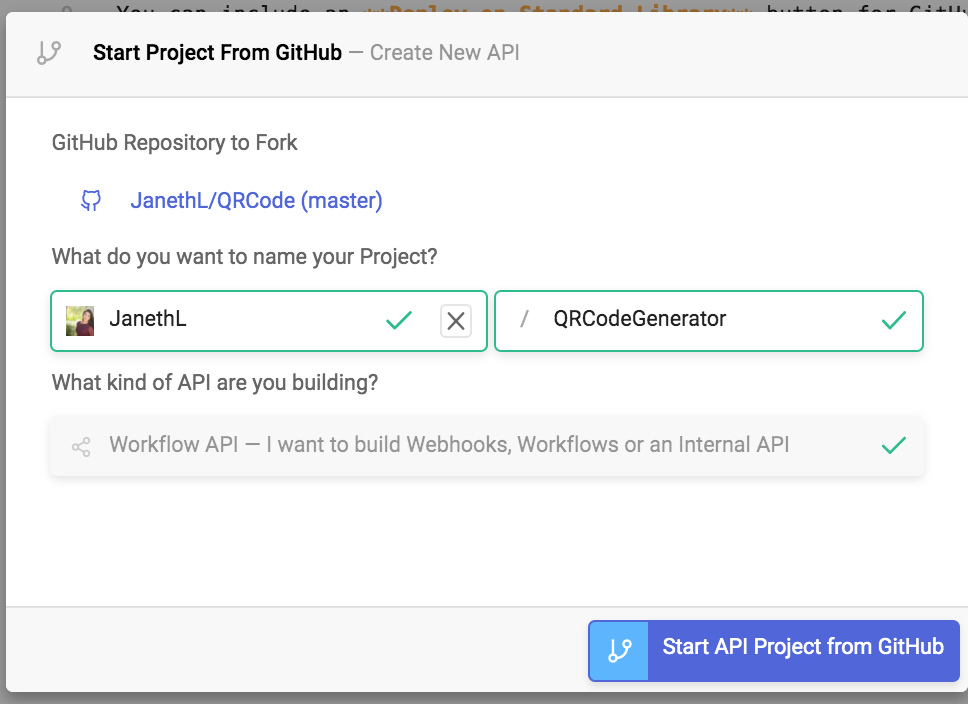

Navigate through the `functions` folder on the left and select `QRCode.js` file.

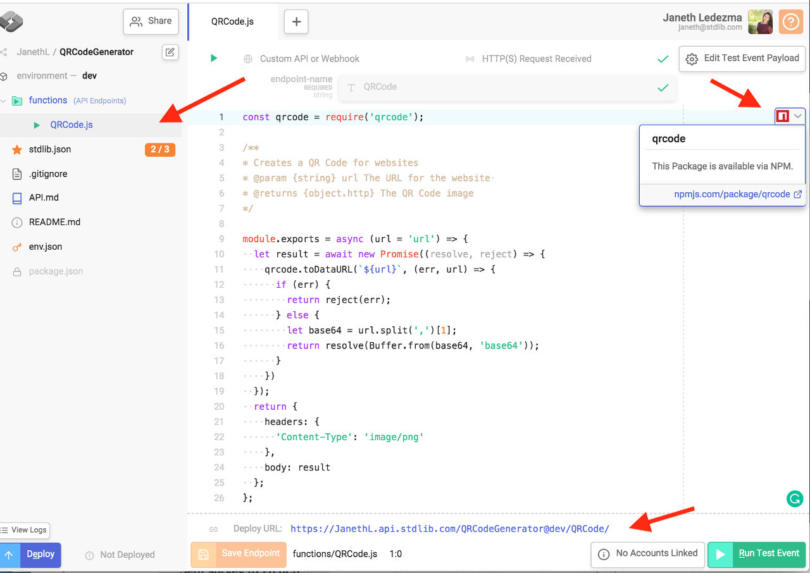

Standard Library automatically generates HTTP endpoints (URLs) for each file.

This URL consists of `<username>.api.stdlib.com/<projectName>@environment/<endpointName>` and it will be available after you deploy your project in the next steps. 

For example:

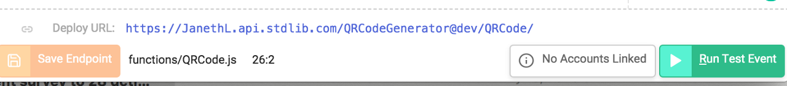

## A Brief Explanation:

The first line of code imports the [node QRcode NPM package](https://www.npmjs.com/package/qrcode). Autocode automatically adds dependencies to `package.json` file when importing NPM packages.

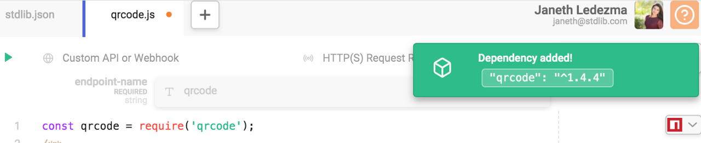

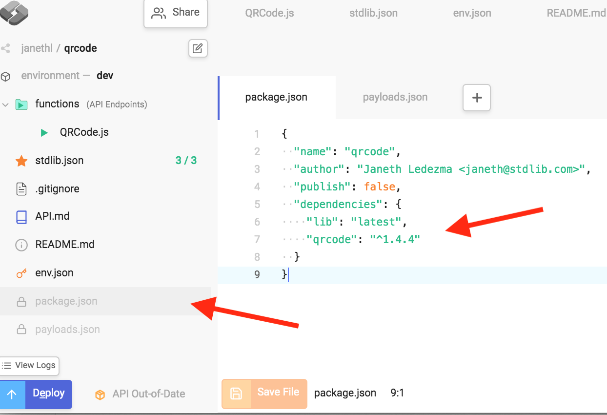

**Lines 3–7** is a comment that serves as documentation and allows Standard Library to type check requests to our APIs. If a request does not supply a parameter with an expected type, it will return an error. You can learn more about the parameters and types here: https://github.com/FunctionScript/FunctionScript

This QRCode API endpoint has a parameter expecting a string that passes in a URL. It will return an HTTP Response as an object. The headers are set to `{"Content-Type": "image/png"}` on **line 22** and the body (**line 24**) is the result we define on **line 10**.

**Line 9** is a function `(module.exports)` that will export our entire code found in **lines 9–26**. Once you deploy your code, this function will be wrapped into an HTTP endpoint (API endpoint) and will be made available at:

`https://<username>.api.stdlib.com/<ProjectName>@dev/<EndpointName>`

## Test Run the Code:

Before you deploy your API give it a test run. Find and select the **Edit Test Event Payload** button on the upper right.

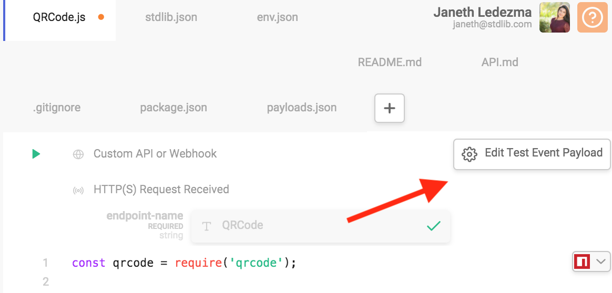

Set the `url` to a site you'd like to generate a QRCode image for and click Save Payload. Payloads must be JSON formatted like this:

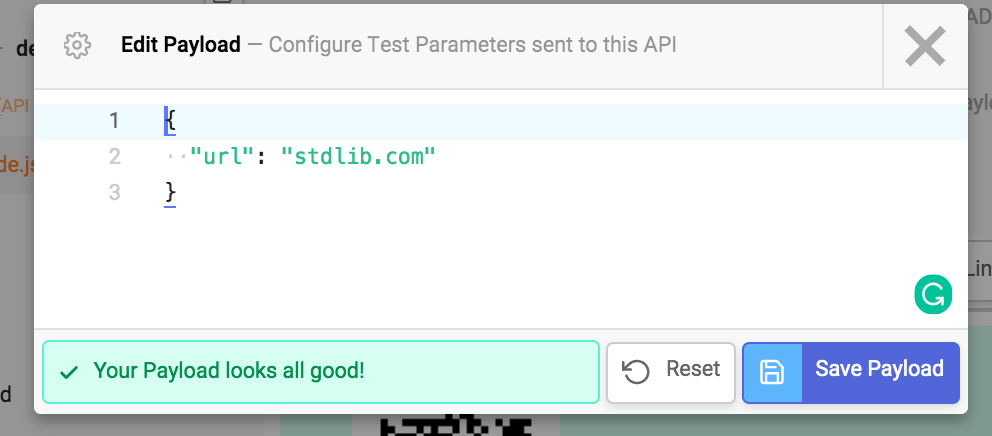

When you select **Run Test Event**, you'll see the QR code image result rendered by Autocode.

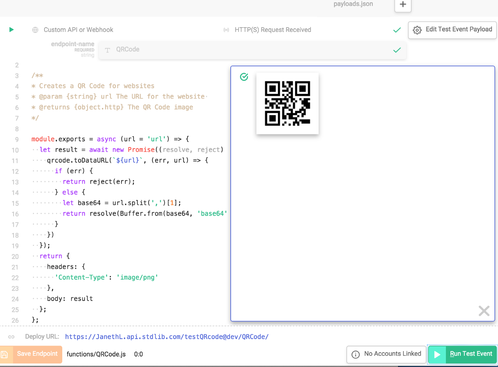

Take out your phone's camera and test it out!

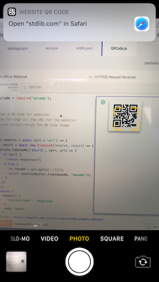

## 🚀 Ship your QRCode API Generator

You're ready to deploy your QRCode API! Select Deploy in the bottom-left of the file manager.

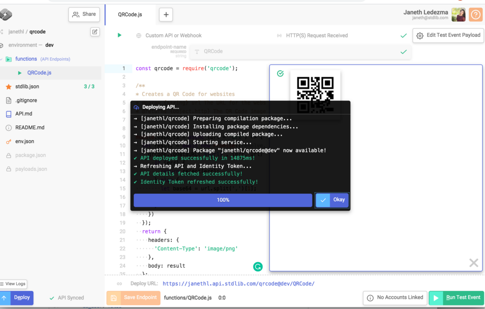

Congrats! 🎉 Your QRCode service is live! You can see the documentation for your APIs by typing `https://stdlib.com/@<username>/lib/<projectName>/dev/` in the browser.

Alternatively, find the manager button on the upper left and select View dev API Reference.

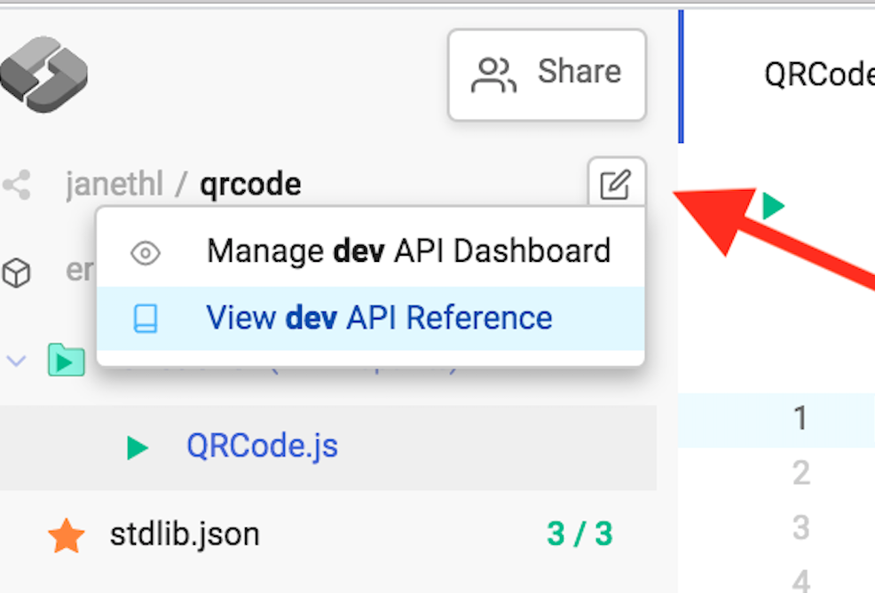

Your APIs docs will open up in a different tab. You can also test your API right from the docs by passing in any URL.

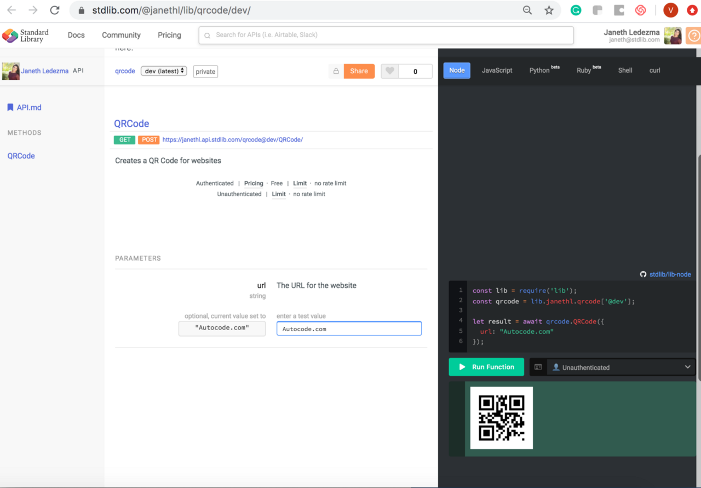
